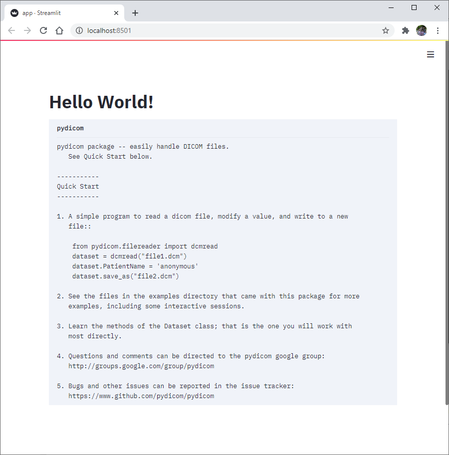
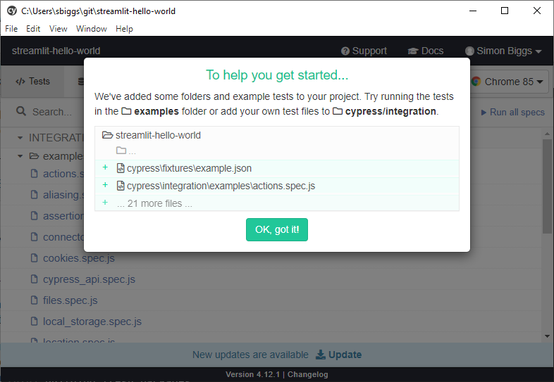

# Hello world for streamlit and pydicom

## What you need to have done before the lecture

### Installation of git, python, and yarn

Installed the following:

* git -- <https://git-scm.com/>
* yarn -- <https://classic.yarnpkg.com/en/docs/install/>
* python -- <https://www.python.org/downloads/>

### Git and GitHub

Made a GitHub account -- <https://github.com/>

Gone through the following two pages within the "don't be afraid to commit" tutorial:

* <https://dont-be-afraid-to-commit.readthedocs.io/en/latest/git/git.html>
* <https://dont-be-afraid-to-commit.readthedocs.io/en/latest/git/commandlinegit.html>

### Installing local requirements and testing they work

Then using the skills you have gained in the above tutorial, fork this repository to your own account and run
the following within your local version:

```bash
pip install -r requirements.txt
```

Then test that this has worked by running:

```bash
streamlit run app.py
```

Where you should see a browser window open that looks like the following:



Next, you need to run the following to install cypress:

```bash
yarn
```

And then to test you need to run:

```bash
yarn run cypress open
```

Which should open a Window that looks like the following:


